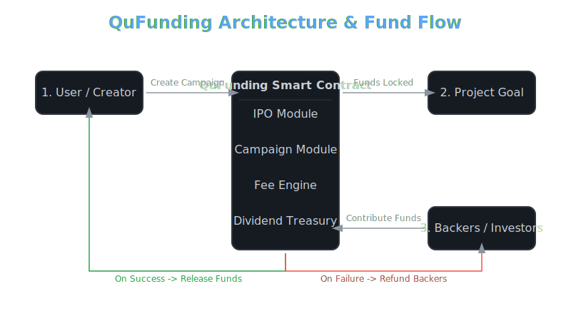

<table>
  <tr>
    <td><h1> QuFunding: Decentralized Crowdfunding on Qubic</h1></td>
    <td align="right">
      
      
      
    </td> 
  </tr>
</table>


---

## 🧠 What is QuFunding?

**QuFunding** is a fully on chain, decentralized crowdfunding platform built with **C++** as a smart contract on the **Qubic network**. It empowers creators and innovators to raise capital for their projects in a **trustless**, **transparent**, and **automated** way.

> 💡 More than just crowdfunding — it’s a **tokenized DAO** with **built in deflationary economics** and **dividend payouts**.

---

## 🏗️ How It Works

QuFunding operates as a **Decentralized Autonomous Organization (DAO)** and features an **Initial Platform Offering (IPO)**. Early supporters can buy shares and earn:

- **Dividends** from platform fees 💰
- **Deflationary gains** from automatic share burns 🔥

This creates a self sustaining economy that rewards participation and long term support.

---

## 🔧 System Architecture

<p align="center">
  
</p>

---

##   Core Features & Ecosystem Benefits

|   **Feature**               | 🌱 **Benefit for Qubic Ecosystem** |
|-----------------------------|------------------------------------|
| **Decentralized Crowdfunding** | Transparent, automated capital raising without middlemen. |
| **DAO & IPO Model**            | Shareholders own and govern the platform. |
| **Deflationary Share Burn**    | Reduces supply, increasing value of remaining shares. |
| **Automated, Secure Payouts**  | No counterparty. Risk smart contract guarantees fund logic. |
| **Governance Ready**           | Shareholders can vote on future upgrades and fee structures. |

---

##  Prerequisites

- 🔐 A Qubic Wallet to interact with the platform.
- 📘 Basic knowledge of smart contracts and blockchain fundamentals.

---

## 🧬 Under the Hood: Contract Code Snippets

The smart contract is written in **C++** and contains all platform logic. Here are a few key functions:

### The Contract's State
This `struct` defines all the data stored on-chain. Note the inclusion of `totalSharesBurned` to transparently track the deflationary mechanism's impact.
```cpp
struct ContractState {
    bool isInitialized;
    uint8_t owner;
    long long ipoEndEpoch;
    long long ipoSharePrice;
    long long creationFee;
    Shareholder shareholders[MAX_SHAREHOLDERS];
    uint16_t shareholderCount;
    long long totalSharesIssued;
    long long cumulativeRevenuePerShare;
    long long treasury; // Holds funds for dividends
    Campaign campaigns[MAX_CAMPAIGNS];
    uint16_t campaignCount;
    long long totalSharesBurned; // Tracks burned shares
};
```

### The Burn & Dividend Engine
This is the heart of the economic model. The processPlatformFee function is called whenever a fee is collected. It splits the fee, sending one portion to burn shares and the other to the dividend treasury.

```cpp
// Defines what percentage of collected fees will be used to burn shares.
constexpr int BURN_PERCENT_OF_FEES = 50;

void processPlatformFee(long long feeAmount) {
    auto* state = get_state_ptr<ContractState>();
    
    // 1. Calculate the split
    long long burnAmount = feeAmount * BURN_PERCENT_OF_FEES / 100;
    long long dividendAmount = feeAmount - burnAmount;

    // 2. Process the burn
    if (burnAmount > 0 && state->ipoSharePrice > 0) {
        long long sharesToBurn = burnAmount * QU / state->ipoSharePrice;
        state->totalSharesIssued -= sharesToBurn;
        state->totalSharesBurned += sharesToBurn;
    }

    // 3. Process the dividends
    if (dividendAmount > 0) {
        state->treasury += dividendAmount;
        state->cumulativeRevenuePerShare += dividendAmount * QU / state->totalSharesIssued;
    }
}
```

## Automated Campaign Finalization
This logic demonstrates the trustless nature of the platform. Once a campaign's end epoch is reached, the contract will execute the outcome based on immutable rules.

```cpp

void handleFinalizeCampaign(const Request& req) {
    // ... assertions to ensure validity ...
    
    Campaign* c = &state->campaigns[payload->campaignId];

    if (c->raised >= c->goal) {
        // SUCCESS
        c->state = STATE_SUCCESSFUL;
        long long fee = c->raised * SUCCESS_FEE_PERCENT / 100;
        processPlatformFee(fee);
        transfer(c->beneficiary, c->raised - fee);
    } else {
        // FAILURE
        c->state = STATE_FAILED;
        long long fee = c->raised * FAILURE_FEE_PERCENT / 100;
        processPlatformFee(fee);
        
        // Refund all backers proportionally
        long long refundPool = c->raised - fee;
        for (int i = 0; i < c->contributorCount; ++i) {
            long long refund = refundPool * c->contributions[i].amount / c->raised;
            transfer(c->contributions[i].contributor, refund);
        }
    }
}


```


## Feel free to contact for any sugguestions at devinliggins56@gmail.com 

