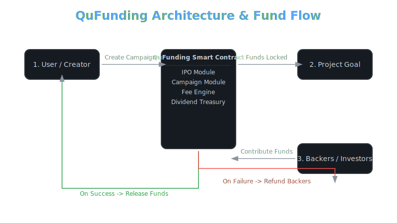

<table>
  <tr>
    <td><h1> QuFunding: Decentralized Crowdfunding on Qubic</h1></td>
    <td align="right">
      
      
  </tr>
</table>


---

## 🧠 What is QuFunding?

**QuFunding** is a fully on-chain, decentralized crowdfunding platform built with **C++** as a smart contract on the **Qubic network**. It empowers creators and innovators to raise capital for their projects in a **trustless**, **transparent**, and **automated** way.

> 💡 More than just crowdfunding — it’s a **tokenized DAO** with **built-in deflationary economics** and **dividend payouts**.

---

## 🏗️ How It Works

QuFunding operates as a **Decentralized Autonomous Organization (DAO)** and features an **Initial Platform Offering (IPO)**. Early supporters can buy shares and earn:

- **Dividends** from platform fees 💰
- **Deflationary gains** from automatic share burns 🔥

This creates a self-sustaining economy that rewards participation and long-term support.

---

## 🔧 System Architecture

<p align="center">
  
</p>

---

## 🌟 Core Features & Ecosystem Benefits

| 🚀 **Feature**               | 🌱 **Benefit for Qubic Ecosystem** |
|-----------------------------|------------------------------------|
| **Decentralized Crowdfunding** | Transparent, automated capital raising without middlemen. |
| **DAO & IPO Model**            | Shareholders own and govern the platform. |
| **Deflationary Share Burn**    | Reduces supply, increasing value of remaining shares. |
| **Automated, Secure Payouts**  | No counterparty risk—smart contract guarantees fund logic. |
| **Governance Ready**           | Shareholders can vote on future upgrades and fee structures. |

---

## ✅ Prerequisites

- 🔐 A Qubic Wallet to interact with the platform.
- 📘 Basic knowledge of smart contracts and blockchain fundamentals.

---

## 🧬 Under the Hood: Contract Code Snippet

The smart contract is written in **C++** and contains all platform logic. Here's a peek at the `ContractState` structure:

```cpp
struct ContractState {
    bool isInitialized;
    uint8_t owner;
    long long ipoEndEpoch;
    long long ipoSharePrice;
    long long creationFee;
    Shareholder shareholders[MAX_SHAREHOLDERS];
    uint16_t shareholderCount;
    long long totalSharesIssued;
    long long cumulativeRevenuePerShare;
    long long treasury; // Holds funds for dividends
    Campaign campaigns[MAX_CAMPAIGNS];
    uint16_t campaignCount;
    long long totalSharesBurned; // Tracks burned shares
};
